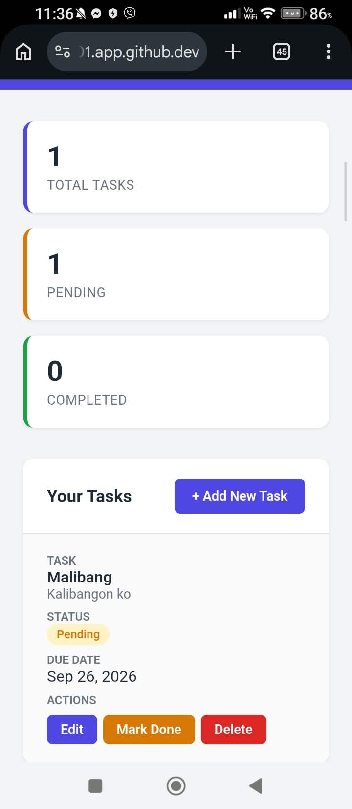
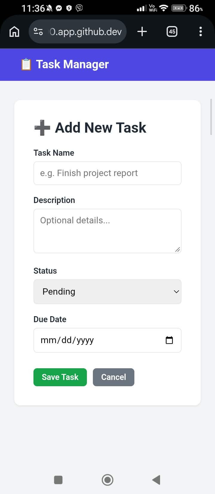

# Personal Task Manager (Laravel)

Project Code: WST21-PM-2026-SF
Student Name: COMENDADOR JAMES D.
Course & Year: BSIT 2, SECTION 2
Database Used: SQLite

## Features
- Add Task
- View Tasks
- Edit Task
- Delete Task
- Update Status

## Additional Features
- Dashboard summary cards (Total, Pending, Completed tasks)
- Responsive design (mobile-friendly table view)
- Status badges for quick visual reference

## Tech Stack
- Laravel (Routes → Controller → Model → Database → Blade)
- SQLite
- Blade Templating
- Plain CSS (no external frameworks)

## How to Run Locally
1. Clone the repository
2. Navigate to the project folder: `cd task-manager`
3. Install dependencies: `composer install`
4. Copy `.env.example` to `.env` and run `php artisan key:generate`
5. Create the SQLite database file: `touch database/database.sqlite`
6. Set `DB_CONNECTION=sqlite` in `.env`
7. Run migrations: `php artisan migrate`
8. Start the server: `php artisan serve`
